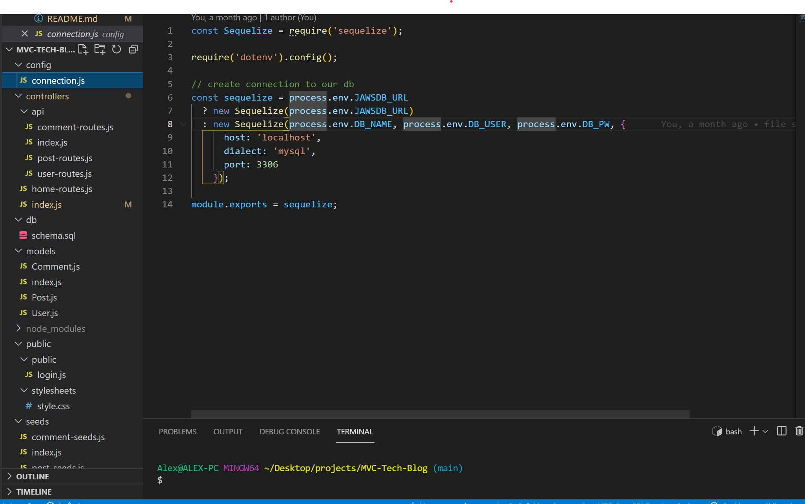
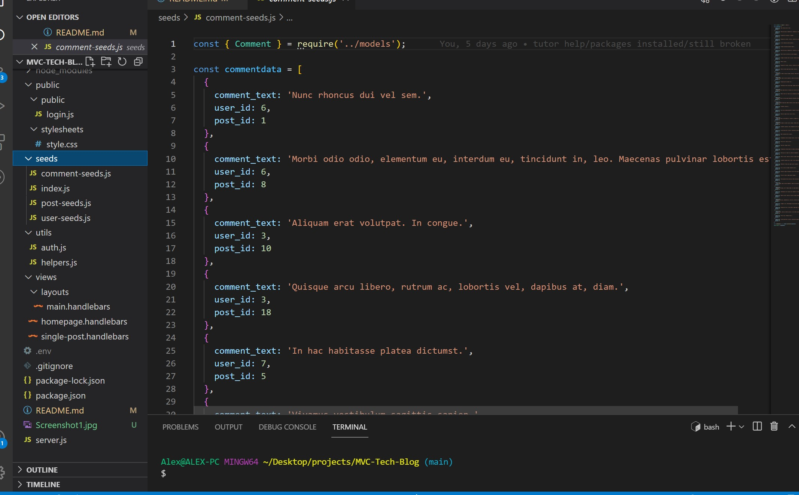

# MVC-Tech-Blog

## Purpose
A CMS-style blog site similar to a Wordpress site, where developers can publish their blog posts and comment on other developers’ posts as well.

## Built With
* JavaScript
* Inquirer
* JSON
* Node.js
* MySQL2
* dotenv
* express
* sequelize
* handlebars

## Github Link
https://github.com/christenson10/MVC-Tech-Blog.git

## README Preview 1
Example of showing find all categories

## README Preview 2
Example of showing fine one category
